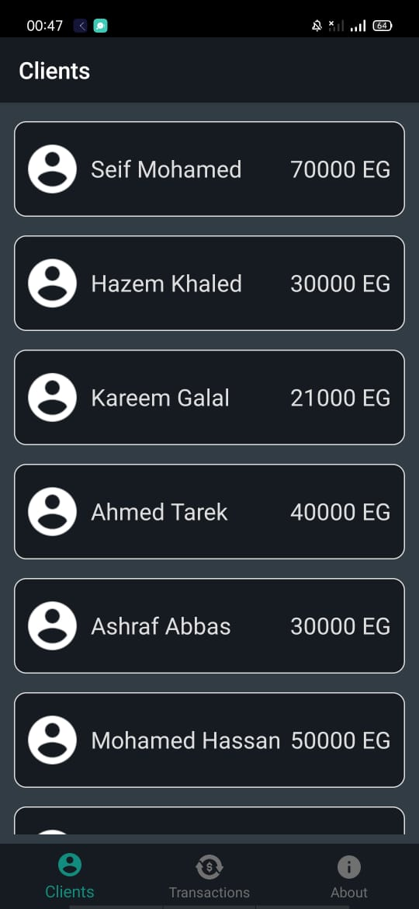
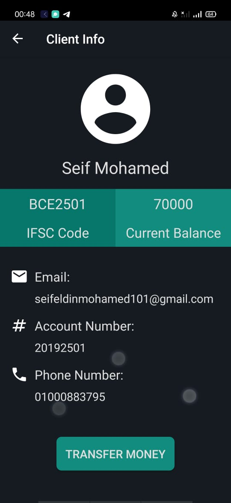
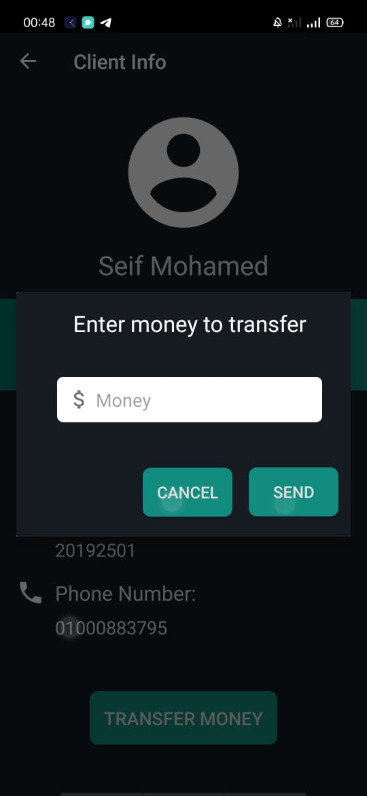
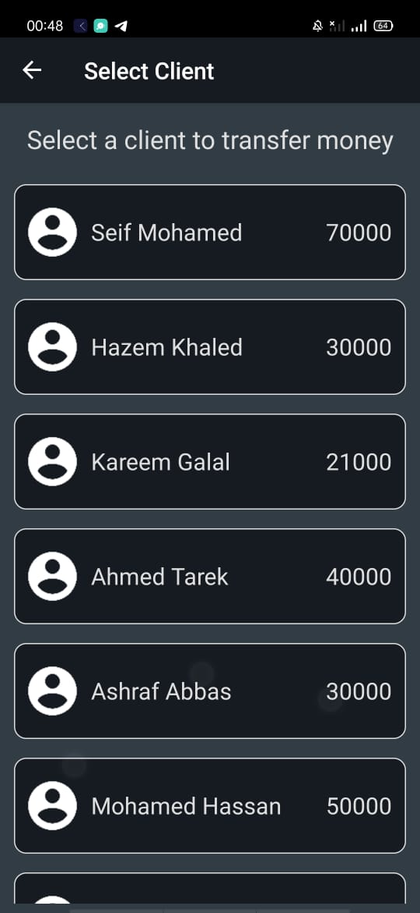
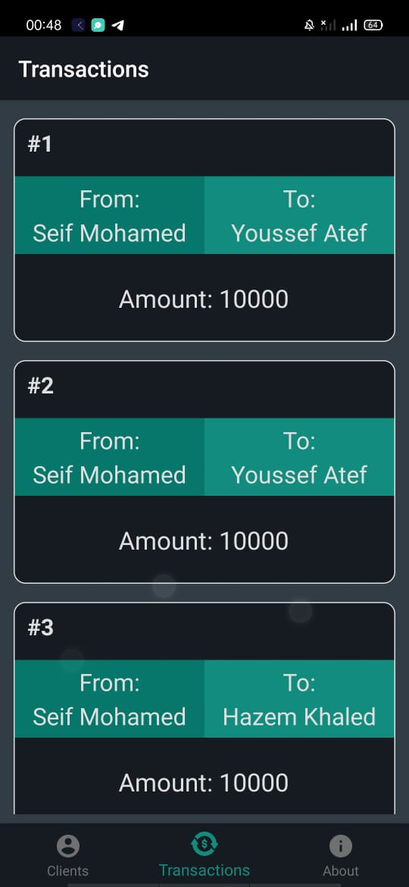

# SimpleBankApp-SparksInternshipTask

# Objective:
The aim of this task is to create a simple banking app in which the user 
can see their other listed users and their bank details. Also, they can transfer
money to other user’s accounts and can see the transactions history.

# Built With:
• Kotlin 
• MVVM Architecture Pattern 
• SQLite Database with Room 
• Coroutines 
• Navigation Component 
• Live Data 
• Recycler View + DiffUtil + Recycler Animation 
• I used the principle of single Activity and multiple Fragments  

# Screen Shots:

